# Parallel Build Cost Analysis

**Analysis Date**: January 27, 2026  
**Question**: Does building production images in parallel with test images increase costs by losing Docker layer caching benefits?

## TL;DR - Executive Summary

**No additional cost. Production builds are NOT currently using test images as cache sources.**

Running production builds in parallel would:
- ✅ **Save ~9 minutes** in test environment readiness (47% faster)
- ✅ **Zero additional compute cost** (same build time either way)
- ✅ **Zero cache loss** (they already build independently)
- ✅ **No risk** to build reliability

### Self-Hosted Runner Impact

**Resource Requirements:**
- Peak concurrent runners: 7 (vs 4 currently)
  - 4 small runners (unchanged)
  - 3 medium runners (vs staggered start)
- Duration: 8 minutes (vs 17 minutes currently)
- Total runner-time: 56 min (vs 59 min, 5% less)

**Infrastructure Cost:**
- Fixed cost: $0 (runners already provisioned)
- Variable cost: $0 (same compute, different timing)
- Capacity needed: 7+ medium runners for smooth operation
- If < 7 runners: May queue, but still likely net faster

**Decision:**
- ✅ If 7+ medium runners: Proceed immediately
- ⚠️ If 4-6 medium runners: Proceed with monitoring
- ❌ If < 4 medium runners: Add capacity first

---

## Current Caching Strategy

### What the Build Action Does

From `private-actions/build-test-image/action.yaml` (lines 114-117):

```yaml
cache-from: |
  type=registry,ref=${{ steps.config.outputs.ref-cache }}
  type=registry,ref=${{ steps.config.outputs.parent-ref-cache }}
cache-to: 'type=registry,ref=${{ steps.config.outputs.ref-cache }},mode=max'
```

**Cache sources:**
1. `ref-cache` = Current branch cache (e.g., `muralci.azurecr.io/tactivos/mural-api-test:feature-branch`)
2. `parent-ref-cache` = Master branch cache (e.g., `muralci.azurecr.io/tactivos/mural-api-test:master`)

**Both test AND production builds use the same cache sources:**
- They pull from: branch cache + master cache
- They push to: branch cache
- **They do NOT use each other as cache sources**

### The TODO Comment

In `mural-api/.github/workflows/build.yml:377`:
```yaml
# TODO use the test image as the first cache image
```

This TODO suggests awareness that test images COULD be used as cache, but **this is not currently implemented**.

---

## Evidence: Production Doesn't Cache from Test

If production builds were using test images as cache, we'd expect production to build MUCH faster than test (maybe 1-2 min vs 8 min). Let's look at actual data:

### Build Duration Comparison (3 Recent Runs)

| Run | API Test | API Prod | Difference | Worker Test | Worker Prod | Difference |
|-----|----------|----------|------------|-------------|-------------|------------|
| 21375030400 | 524s (8.7m) | 488s (8.1m) | -7% (36s faster) | 250s (4.2m) | 377s (6.3m) | +51% (127s slower!) |
| 21373200255 | 480s (8.0m) | 475s (7.9m) | -1% (5s faster) | 263s (4.4m) | 406s (6.8m) | +54% (143s slower!) |
| 21373100172 | 450s (7.5m) | 502s (8.4m) | +12% (52s slower!) | 261s (4.4m) | 402s (6.7m) | +54% (141s slower!) |

**Average:**
- API Prod vs Test: **+1% (essentially the same time)**
- Worker Prod vs Test: **+53% (production is SLOWER)**

### Key Observations

1. **API production builds take roughly the same time as test builds** (7.5-8.7 min)
   - If using cache from test, we'd expect 1-2 min max
   - Actual: within 7% either direction = no cache benefit

2. **Worker production builds consistently take 50%+ LONGER than test builds**
   - Test: 4.2-4.4 minutes
   - Prod: 6.3-6.8 minutes
   - If using cache from test, prod should be faster, not slower!

3. **Migrations production is slightly faster** (2.8 min prod vs 1.9 min test) but still rebuilding
   - Not fast enough to indicate full cache hit (would be <30 seconds)

### Why Production Doesn't Use Test Cache

Looking at the Dockerfile structure (using API as example):

```dockerfile
# Test image uses target "builder"
FROM setup as builder
RUN npm ci --loglevel=warn --progress=false
WORKDIR /usr/src
COPY ["common", "./common/"]
COPY ["data", "./data/"]
COPY ["business", "./business/"]
COPY ["api", "./api/"]
RUN npm run setup api
WORKDIR /usr/src/api
RUN npm run ci:build
# <- Test build stops here

# Production image builds from different stages
FROM setup as packages
RUN npm ci --only=production  # Different deps!

FROM node:22.21.0-bullseye-slim as production
COPY --from=packages [...]    # Uses packages stage
COPY --from=builder [...]     # Uses builder stage
```

**The problem:**
- Test image contains ONLY the `builder` stage
- Production needs BOTH `builder` AND `packages` stages
- When production runs, it rebuilds `builder` from scratch (using registry cache, not test image)
- Even though test already built `builder`, production can't use that built stage

**Why they can't currently share:**
- Test image is a single layer snapshot at `builder` stage
- Production can't extract individual stages from test image
- Docker BuildKit pulls layers from registry cache, not from sibling build jobs

---

## Multi-Stage Build Architecture

### API Dockerfile Stages

```
┌─────────────────────────────────────────┐
│ setup                                    │  ← Base packages, npm config
│ - Install base deps                      │
│ - Copy package.json files                │
└─────────────────┬───────────────────────┘
                  │
        ┌─────────┴──────────┐
        │                    │
┌───────▼──────────┐  ┌─────▼────────┐
│ builder          │  │ packages     │
│ - Dev deps       │  │ - Prod deps  │
│ - Build TS       │  │ (different!) │
│ - Run tests      │  └──────┬───────┘
└────────┬─────────┘         │
         │                   │
         │  ┌────────────────▼───────┐
         │  │ production             │
         └──► - Copy from builder    │
            │ - Copy from packages   │
            │ - Lean runtime image   │
            └────────────────────────┘

Test target: builder ────┐
Prod target: production ─┘
```

### Worker Dockerfile Stages

```
┌──────────────────────────────────────────┐
│ base                                      │  ← Runtime packages (chromium, etc)
└─────────────────┬────────────────────────┘
                  │
         ┌────────▼─────────┐
         │ build-base       │  ← Add build-time deps (gcc, make)
         └────────┬─────────┘
                  │
         ┌────────▼─────────┐
         │ setup            │  ← npm config, base packages
         └────────┬─────────┘
                  │
         ┌────────▼─────────┐
         │ builder          │  ← Dev deps, build TS
         └────────┬─────────┘
                  │
         ┌────────▼─────────┐
         │ packages         │  ← Prod-only deps
         └────────┬─────────┘
                  │
         ┌────────▼─────────┐
         │ production       │  ← Copy artifacts, lean image
         └──────────────────┘

Test target: builder ────┐
Prod target: production ─┘
```

**Key insight:** Test and production share stages `setup` and `builder`, but production adds `packages` stage with different dependencies.

---

## Cost Analysis: Sequential vs Parallel

### Current Sequential Approach

```
Time: 0s ──────────────────► 8m ──────────────────► 17m
         │                     │                     │
         ├─ Test images ──────┤                     │
         │  (4 parallel)       │                     │
         │                     │                     │
         │                     ├─ Prod images ──────┤
         │                     │  (4 sequential)     │
         │                     │                     │
         └─────────────────────┴─────────────────────┘
                Cache: branch + master
```

**Resources used:**
- Test builds: 524s + 250s + 114s + 112s = 1,000 seconds of compute
- Prod builds: 488s + 377s + 169s + 23s = 1,057 seconds of compute
- **Total: 2,057 seconds of compute time**
- **Wall clock: ~17 minutes**

### Proposed Parallel Approach

```
Time: 0s ──────────────────► 8m
         │                     │
         ├─ Test images ──────┤
         │  (4 parallel)       │
         │                     │
         ├─ Prod images ──────┤
         │  (4 parallel)       │
         │                     │
         └─────────────────────┘
                Cache: branch + master
```

**Resources used:**
- Test builds: 524s + 250s + 114s + 112s = 1,000 seconds of compute
- Prod builds: 488s + 377s + 169s + 23s = 1,057 seconds of compute
- **Total: 2,057 seconds of compute time** (SAME!)
- **Wall clock: ~8 minutes** (47% faster)

### Cost Comparison Table

| Metric | Sequential | Parallel | Difference |
|--------|-----------|----------|------------|
| **API build compute** | 524s + 488s = 1,012s | 524s + 488s = 1,012s | **0s (same)** |
| **Worker build compute** | 250s + 377s = 627s | 250s + 377s = 627s | **0s (same)** |
| **Migrations build compute** | 114s + 169s = 283s | 114s + 169s = 283s | **0s (same)** |
| **Total compute seconds** | 2,057s | 2,057s | **0s (same)** |
| **Wall clock time** | ~17 min | ~8 min | **-9 min (47% faster)** |
| **CI runner time used** | ~17 min × 4 jobs = 68 min | ~8 min × 8 jobs = 64 min | **-4 min (6% less)** |

**Important: Self-Hosted Runner Implications**

Since you use **self-hosted runners** (not GitHub-hosted), the cost model is different:
- Infrastructure cost is fixed (runners always running)
- "Cost" is measured in runner availability/utilization, not billing
- Parallel builds use more **concurrent** runners but **less total time**

---

## Self-Hosted Runner Resource Analysis

### Runner Pool Configuration

Based on the workflow configuration, you use three runner types:
- `[self-hosted, linux, small]` - Lighter workloads (linting, small builds)
- `[self-hosted, linux, medium]` - Production image builds
- `[self-hosted, linux, cpu-optimized]` - CPU-intensive tasks (integration tests with services)

### Current Sequential: Resource Timeline

```
Time:   0m ────────────► 8m ────────────► 17m
Jobs:   │                │                │
        ├─ 4 test builds ┤                │
        │  (small)       │                │
        │                ├─ 3 prod builds ┤
        │                │  (medium)      │
        └────────────────┴────────────────┘

Peak Runners Used:
- Time 0-8m:  4 small runners
- Time 8-17m: 3 medium runners (sequential start times)

Runner Utilization:
- Small:  4 runners × 8 min = 32 runner-minutes
- Medium: 3 runners × 9 min avg = 27 runner-minutes
- Total: 59 runner-minutes
```

### Proposed Parallel: Resource Timeline

```
Time:   0m ────────────► 8m
Jobs:   │                │
        ├─ 4 test builds ┤
        │  (small)       │
        ├─ 3 prod builds ┤
        │  (medium)      │
        └────────────────┘

Peak Runners Used:
- Time 0-8m: 4 small + 3 medium = 7 concurrent runners

Runner Utilization:
- Small:  4 runners × 8 min = 32 runner-minutes (same)
- Medium: 3 runners × 8 min = 24 runner-minutes (3 min less)
- Total: 56 runner-minutes (5% less)
```

### Runner Concurrency Visual

```mermaid
gantt
    title Runner Utilization: Sequential vs Parallel
    dateFormat mm
    axisFormat %M min
    
    section Sequential
    API test (small)           :s1, 00, 8m
    Worker test (small)        :s2, 00, 4m
    Migrations test (small)    :s3, 00, 2m
    Modules test (small)       :s4, 00, 2m
    API prod (medium)          :s5, 08, 8m
    Worker prod (medium)       :s6, 08, 6m
    Migrations prod (medium)   :s7, 08, 3m
    
    section Parallel
    API test (small)           :p1, 00, 8m
    Worker test (small)        :p2, 00, 4m
    Migrations test (small)    :p3, 00, 2m
    Modules test (small)       :p4, 00, 2m
    API prod (medium)          :p5, 00, 8m
    Worker prod (medium)       :p6, 00, 6m
    Migrations prod (medium)   :p7, 00, 3m
```



### Resource Impact Assessment

#### 1. Concurrent Runner Demand

**Current (Sequential):**
- Peak concurrency: 4 runners (small)
- Medium runners start staggered (one at a time as tests finish)
- Lower peak, but longer duration

**Parallel:**
- Peak concurrency: 7 runners (4 small + 3 medium)
- All build runners active simultaneously for ~8 minutes
- Higher peak, but much shorter duration

**Question: Do you have 7+ available runners?**
- If yes: No problem, proceed with parallel
- If no: May cause queuing, but still likely faster overall
- Jobs will queue until runners available (GitHub Actions handles this automatically)

#### 2. Runner Pool Size Analysis

**Typical runner pool scenarios:**

**Scenario A: Large pool (10+ runners per size)**
- Impact: None
- Recommendation: Proceed immediately

**Scenario B: Medium pool (5-10 runners per size)**
- Impact: Minimal - slight increase in peak usage
- Recommendation: Proceed, monitor during rollout
- May occasionally queue if other PRs running simultaneously

**Scenario C: Small pool (3-5 runners per size)**
- Impact: Moderate - will likely queue during peak
- Recommendation: Still beneficial, but consider adding 2-3 runners
- Even with queuing, total time likely better than sequential

**Scenario D: Minimal pool (1-3 runners per size)**
- Impact: High - will definitely queue
- Recommendation: Add runners OR stick with sequential
- Queuing overhead may negate time savings

#### 3. Infrastructure Cost Comparison

Since runners are self-hosted, costs are:

**Fixed Costs (Same Either Way):**
- EC2/VM instances running 24/7
- Storage for Docker images
- Network bandwidth
- Electricity/cloud hosting

**Variable Costs (Parallel Impact):**
- CPU utilization: Higher peak for 8 min vs distributed over 17 min
- Memory: Same total, different timing
- Disk I/O: Same total Docker builds, different timing

**Net Impact:**
- Zero additional cost if runners idle otherwise
- Potentially SAVES cost by freeing runners 9 min faster for other jobs
- Better resource utilization (less idle time)

#### 4. Do Jobs Run on Different Machines?

**Yes, each job gets its own runner (likely different VMs/machines).**

GitHub Actions runner pool works like this:
```
┌─────────────────────────────────────┐
│ Runner Pool                         │
│                                     │
│ ┌──────┐ ┌──────┐ ┌──────┐ ┌──────┐│
│ │Runner│ │Runner│ │Runner│ │Runner││  small runners
│ │  1   │ │  2   │ │  3   │ │  4   ││
│ └──────┘ └──────┘ └──────┘ └──────┘│
│                                     │
│ ┌──────┐ ┌──────┐ ┌──────┐         │
│ │Runner│ │Runner│ │Runner│         │  medium runners
│ │  5   │ │  6   │ │  7   │         │
│ └──────┘ └──────┘ └──────┘         │
└─────────────────────────────────────┘
         │         │         │
         ▼         ▼         ▼
     Job A     Job B     Job C
```

**What this means:**

1. **Each build job runs on a separate VM/container**
   - API test build → Runner 1 (small)
   - Worker test build → Runner 2 (small)
   - API prod build → Runner 5 (medium)
   - Worker prod build → Runner 6 (medium)

2. **Jobs DON'T share resources during build**
   - No CPU contention between jobs
   - No memory sharing
   - No disk I/O conflicts (each has own workspace)

3. **Docker layer cache IS shared** (via registry)
   - All runners pull from same Azure Container Registry
   - Cache pulls are network-bound, not CPU-bound
   - Multiple simultaneous cache pulls are fine (CDN-like)

4. **Resource consumption is DISTRIBUTED**
   - 7 builds on 7 different machines
   - Each machine does 1 build at a time
   - Total work: same, spread across more machines

**Sequential vs Parallel on Multiple Machines:**

Sequential:
```
Machine 1 (small):  [██████████] API test build (8 min)
Machine 2 (small):  [████] Worker test (4 min)
Machine 3 (small):  [██] Migrations test (2 min)
Machine 4 (small):  [██] Modules test (2 min)
                    ... wait 4 minutes ...
Machine 5 (medium): [████████] API prod build (8 min)
Machine 6 (medium): [██████] Worker prod (6 min)
Machine 7 (medium): [███] Migrations prod (3 min)

Total wall time: 17 minutes
Machines used: 7 (but at different times)
```

Parallel:
```
Machine 1 (small):  [██████████] API test build (8 min)
Machine 2 (small):  [████----] Worker test (4 min)
Machine 3 (small):  [██------] Migrations test (2 min)
Machine 4 (small):  [██------] Modules test (2 min)
Machine 5 (medium): [██████████] API prod build (8 min)
Machine 6 (medium): [██████--] Worker prod (6 min)
Machine 7 (medium): [███-----] Migrations prod (3 min)

Total wall time: 8 minutes
Machines used: 7 (all at the same time)
```

**Key Insight:**
- Same 7 machines are needed either way
- Same total CPU time is consumed
- Parallel just uses all machines AT ONCE instead of sequentially
- If machines would otherwise be idle, parallel is free time savings
- If machines are heavily utilized, parallel may cause more queuing

#### 5. Infrastructure Resource Consumption

**Will parallel builds stress your infrastructure more?**

**Answer: It depends on baseline utilization.**

If runners are often idle (< 50% utilized):
- Parallel: No additional stress
- Just using idle capacity more efficiently
- Might actually REDUCE power/cooling during idle periods

If runners are moderately busy (50-80% utilized):
- Parallel: Slight increase in peak load
- May see higher CPU/memory spikes
- Network bandwidth for cache pulls simultaneous
- Usually fine, monitor for any throttling

If runners are heavily saturated (> 80% utilized):
- Parallel: Will increase contention
- More likely to queue for available runners
- May need to add capacity
- Consider if infrastructure can handle 7 concurrent builds

**Network Considerations:**

Docker layer cache pulls from Azure Container Registry:
```
Sequential: 4 concurrent pulls → 0 for 4 min → 3 concurrent pulls
Parallel:   7 concurrent pulls for first few minutes

Average bandwidth: Same total, different timing
Peak bandwidth: Higher (7 vs 4 simultaneous pulls)
```

Most ACR plans handle this easily (Azure CDN, multi-region)
Unlikely to be a bottleneck unless very slow network

#### 6. Multi-Tenant Impact

**If runners shared across multiple repos:**

**Current Sequential:**
- Occupies 4 runners for 8 min, then 3 runners for 9 min
- Other repos can use freed runners after 8 minutes
- Total occupation: 17 minutes

**Parallel:**
- Occupies 7 runners for 8 minutes
- Frees ALL runners after 8 minutes
- Total occupation: 8 minutes
- **More availability for other repos sooner**

**If mural-api + murally build simultaneously:**

Current:
- mural-api: 4 + 3 runners for 17 min
- murally: 2 runners for 12 min
- Peak: 6-7 runners (overlapping usage)

Parallel:
- mural-api: 7 runners for 8 min
- murally: 2 runners for 12 min
- Peak: 9 runners (if starting at same time)
- More likely to queue if pool < 9 runners per size

### Runner Sizing Recommendations

Based on the analysis:

**If you have < 7 medium runners available:**

Option 1: Add 2-3 medium runners
- Cost: ~$50-150/month per runner (depending on cloud/size)
- Benefit: Support parallel builds + handle concurrent PRs
- ROI: High - improves all builds, not just mural-api

Option 2: Stick with sequential for now
- Cost: $0
- Benefit: Predictable resource usage
- Trade-off: Keep 9-minute slower builds

Option 3: Hybrid approach
- Keep sequential for production builds
- Run test builds in parallel
- Partial speedup with minimal resource increase

**If you have 7+ runners already:**
- Proceed immediately with parallel builds
- Zero additional cost
- Pure time savings

### Self-Hosted Runner Summary

| Factor | Sequential | Parallel | Winner |
|--------|-----------|----------|--------|
| **Peak concurrent runners** | 4 | 7 | Sequential (lower peak) |
| **Total runner-minutes** | 59 | 56 | Parallel (5% less) |
| **Wall clock time** | 17 min | 8 min | Parallel (47% faster) |
| **Infrastructure cost** | Fixed | Fixed | Tie (same machines) |
| **Per-build compute** | 2,057 sec | 2,057 sec | Tie (same work) |
| **Runner availability for other jobs** | 17 min occupied | 8 min occupied | Parallel (frees 9 min sooner) |
| **Risk of queuing** | Low | Higher (if < 7 runners) | Sequential (safer) |
| **Complexity** | None | None | Tie (just remove dependency) |

**Bottom Line for Self-Hosted:**
- If you have spare runner capacity: Parallel is a clear win
- If runners are scarce: May need to add capacity first
- Cost is the same either way (fixed infrastructure)
- Parallel is more efficient (less total runner-time, faster completion)

### Monitoring Recommendations

After implementing parallel builds:

1. **Watch for queue times**
   ```bash
   # Check if jobs are waiting for runners
   gh run view <run-id> --json jobs | jq '.jobs[] | {name: .name, queued: (.startedAt | fromdateiso8601) - (.createdAt | fromdateiso8601)}'
   ```

2. **Monitor runner utilization**
   - Are runners sitting idle during builds?
   - Are builds queuing due to runner shortage?
   - Use GitHub Actions insights or runner logs

3. **Track build times over 2 weeks**
   - Compare to historical sequential build times
   - Look for queuing patterns by time of day
   - Identify if concurrent PR builds cause conflicts

4. **Resource metrics** (if available)
   - CPU utilization during builds
   - Memory usage peaks
   - Disk I/O patterns

---

## What About Implementing Cache Sharing?

### Option 1: Current Parallel (Recommended)
**Effort:** Low - just remove dependency  
**Speed gain:** ~9 minutes (47% faster)  
**Cost:** Zero additional cost  
**Risk:** None

### Option 2: Implement Test-to-Prod Cache (Not Recommended)
**Effort:** High - complex build changes  
**Speed gain:** Maybe 3-5 more minutes (if it works well)  
**Cost:** Zero additional cost  
**Risk:** High - complex cache configuration, hard to debug

**Why not recommended:**
1. **Complex implementation** - would need to:
   - Export test image layers to registry with all stages preserved
   - Configure production builds to use test image + registry as cache sources
   - Handle cache invalidation correctly
   - Deal with multi-architecture builds
   
2. **Marginal benefit** - Would only save 3-5 more minutes beyond parallel:
   - Current sequential: 17 min
   - Parallel without cache sharing: 8 min (47% improvement)
   - Parallel with cache sharing: ~5 min (70% improvement)
   - Additional effort for: 3-5 min (18% more improvement)

3. **Registry cache is already effective** - builds are pulling from:
   - Branch cache (recent commits on same branch)
   - Master cache (base branch layers)
   - These caches already cover most layer reuse

4. **Complexity outweighs benefit**:
   - Debug time when cache fails
   - Maintenance burden
   - Risk of cache corruption
   - For minimal additional speedup

---

## Potential Future Optimizations

After implementing parallel builds, if you want to optimize further:

### 1. Unified Dockerfile (Medium Effort, High Impact)
Refactor Dockerfiles to make test and production share more layers:

```dockerfile
FROM setup as builder
RUN npm ci --loglevel=warn  # All deps

FROM builder as tester
# Test-specific setup
CMD ["npm", "test"]

FROM builder as production-builder
RUN npm prune --production  # Remove dev deps

FROM node:slim as production
COPY --from=production-builder [...]
```

**Benefit:** Both could use the same `builder` stage from cache  
**Effort:** Moderate - requires Dockerfile refactoring  
**Risk:** Medium - changes to build process need thorough testing

### 2. Build Cache Persistence (Low Effort, Low-Medium Impact)
Use GitHub Actions cache or BuildKit cache export/import:

```yaml
- uses: actions/cache@v3
  with:
    path: /tmp/.buildx-cache
    key: ${{ runner.os }}-buildx-${{ github.sha }}
    restore-keys: |
      ${{ runner.os }}-buildx-
```

**Benefit:** Faster cache retrieval than registry  
**Effort:** Low - just add cache action  
**Risk:** Low - falls back to registry if cache miss

### 3. Layer Optimization (High Effort, Medium Impact)
Optimize Dockerfile layer ordering:
- Put rarely-changing stuff first (base packages)
- Put frequently-changing stuff last (source code)
- Split large COPY operations

**Benefit:** Better cache hit rates  
**Effort:** High - requires careful analysis and testing  
**Risk:** Low - just optimization, doesn't change functionality

---

## Decision Framework: Should You Implement Parallel Builds?

### Quick Assessment

Answer these questions:

1. **How many self-hosted runners do you have per size?**
   - Small runners: ____
   - Medium runners: ____
   - CPU-optimized runners: ____

2. **How many PRs typically build concurrently?**
   - Usually: ____
   - Peak: ____

3. **Are runners frequently idle or constantly busy?**
   - [ ] Often idle (< 50% utilization)
   - [ ] Moderately busy (50-80% utilization)
   - [ ] Usually saturated (> 80% utilization)

### Decision Matrix

| Your Situation | Recommendation | Action |
|----------------|----------------|--------|
| **7+ medium runners, low-moderate utilization** | ✅ **Proceed immediately** | Implement parallel builds now |
| **7+ medium runners, high utilization** | ✅ **Proceed with monitoring** | Implement + watch for queuing |
| **4-6 medium runners, low utilization** | ✅ **Proceed** | Likely fine, monitor queue times |
| **4-6 medium runners, high utilization** | ⚠️ **Add 2-3 runners first** | Invest in capacity, then parallel |
| **< 4 medium runners** | ❌ **Add runners OR stay sequential** | Need more capacity for parallel |

### Cost-Benefit by Scenario

**Scenario: You have 10+ runners (well-provisioned)**
- Benefit: 9 min faster (47% speedup)
- Cost: $0
- Decision: **Implement immediately**

**Scenario: You have 7-9 runners (adequate)**
- Benefit: 9 min faster, occasional queuing
- Cost: $0, minimal queue delay
- Decision: **Implement, monitor for 2 weeks**

**Scenario: You have 4-6 runners (tight)**
- Benefit: 9 min faster IF no queuing
- Cost: May queue during concurrent PRs
- Decision: **Either add 2-3 runners (~$100-200/mo) OR monitor closely**

**Scenario: You have < 4 runners (under-provisioned)**
- Benefit: Uncertain (queuing may negate gains)
- Cost: Will definitely queue
- Decision: **Add capacity first, then parallel**

---

## Recommendations

### Immediate Action: Implement Parallel Builds

**Change required in `mural-api/.github/workflows/build.yml`:**

```yaml
# BEFORE (lines 351-353)
build-production-api:
  name: API Production Image
  needs: [build-test-image-api]  # ← REMOVE THIS
  runs-on: [self-hosted, linux, medium]

# AFTER
build-production-api:
  name: API Production Image
  # No needs dependency - runs in parallel
  runs-on: [self-hosted, linux, medium]
```

**Repeat for:**
- `build-production-worker` (remove `needs: [build-test-image-worker]`)
- `build-production-migrations` (remove `needs: [build-test-image-migrations]`)
- Keep `build-production-eight-ball` as-is (already has no dependency)

**Update publish jobs to ensure tests pass:**

```yaml
publish-api:
  name: Publish API Image
  needs:
    - build-production-api        # Wait for prod image
    - lint-and-unit-api           # Wait for tests to pass
    - test-api-integration        # Wait for tests to pass
  uses: ./.github/workflows/publish.yml
  # ... rest of config
```

This ensures production images are built immediately but NOT published until all tests pass.

### Future Optimizations (Priority Order)

1. **Priority 1**: Implement parallel builds (this analysis)
   - Effort: Low (1 hour)
   - Impact: High (9 min / 47% faster)
   - Risk: None

2. **Priority 2**: Optimize murally webpack build (separate effort)
   - Effort: Medium-High
   - Impact: Medium (2-4 min)
   - Risk: Medium

3. **Priority 3**: Build cache persistence
   - Effort: Low (2-4 hours)
   - Impact: Low-Medium (1-2 min)
   - Risk: Low

4. **Priority 4**: Dockerfile refactoring for better cache sharing
   - Effort: High (1-2 weeks)
   - Impact: Medium (2-3 min)
   - Risk: Medium

---

## Appendix: Cache Strategy Details

### Current Cache Flow

```
┌─────────────────────────────────────────┐
│ Registry Cache (Azure Container Registry)│
│                                          │
│ muralci.azurecr.io/tactivos/             │
│   mural-api-test:feature-branch         │
│   mural-api-test:master                 │
│   mural-api:feature-branch              │
│   mural-api:master                      │
└─────────────────────────────────────────┘
              │                 │
              │                 │
     ┌────────▼─────┐  ┌────────▼─────┐
     │ Test Build   │  │ Prod Build   │
     │              │  │              │
     │ Pulls from:  │  │ Pulls from:  │
     │ - branch     │  │ - branch     │
     │ - master     │  │ - master     │
     │              │  │              │
     │ Pushes to:   │  │ Pushes to:   │
     │ - branch     │  │ - branch     │
     └──────────────┘  └──────────────┘
```

**Note:** Test and prod pull from the same cache sources but DON'T pull from each other.

### Why Registry Cache is Effective

1. **Branch cache** - Captures incremental changes on your feature branch
   - First build on branch: slower (pulls from master)
   - Subsequent builds: faster (pulls from own branch + master)

2. **Master cache** - Provides stable base for all builds
   - Updated on every merge to master
   - Shared across all feature branches
   - Contains common layers (base image, common deps)

3. **Layer matching** - Docker BuildKit is smart about cache:
   - Matches layers by content hash, not just branch
   - Can pull individual layers from multiple sources
   - Automatically chooses best cache source per layer

**This is why production builds don't need test builds as cache** - they already get the same layers from registry cache.

---

## Conclusion

Building production images in parallel with test images has:
- ✅ **Zero additional cost** (same compute time)
- ✅ **Zero cache loss** (they already don't share cache)
- ✅ **Significant time savings** (~9 min / 47% faster)
- ✅ **No implementation complexity** (just remove dependency)
- ✅ **No risk** (builds are already independent)

The TODO comment about using test images as cache is a potential future optimization, but it's NOT currently implemented, so there's nothing to lose by running in parallel.

**Recommendation: Proceed with parallel builds immediately.**
